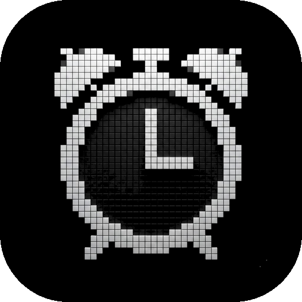
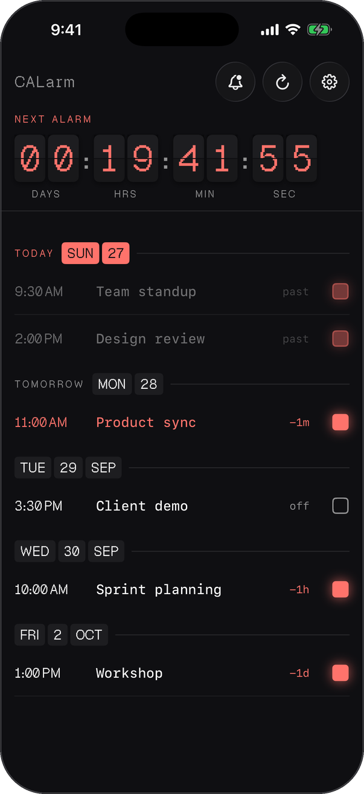
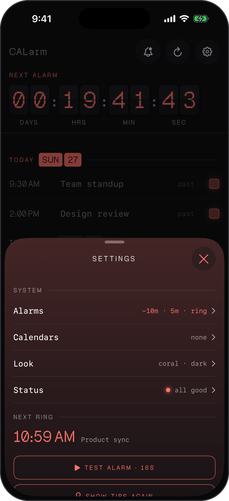
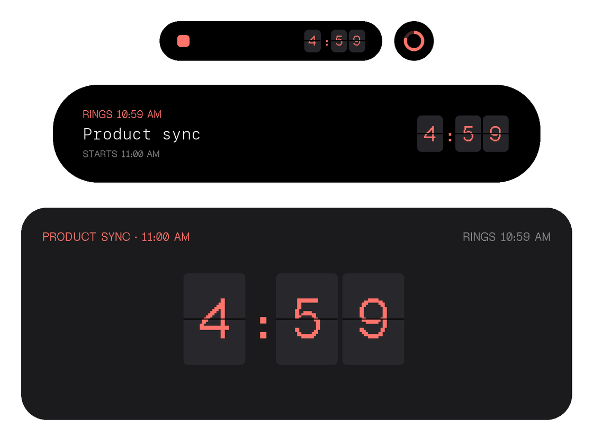

<div align="center">



<h1>CALarm</h1>

<p><b>Your calendar, as real alarms.</b></p>

<p><i>A calendar notification is a banner you swipe away. A meeting deserves an alarm.</i></p>

<h6>


</h6>

<a href="#how-it-works"><b>How it works</b></a> ·
<a href="#features"><b>Features</b></a> ·
<a href="#why-not-just-a-notification"><b>Why</b></a> ·
<a href="#build-it"><b>Build it</b></a>

<br><br>

&nbsp;&nbsp;&nbsp;

<sub>Demo calendar data. Captured from the app's screenshot mode.</sub>

</div>

<br>

## The problem

Calendar reminders are notifications. Silent mode mutes them, Focus hides them, and a
buried banner is exactly how a meeting gets missed. iOS 26 finally lets third-party apps
schedule **real alarms** through AlarmKit: the same full-screen, ring-through-silent alert
as the Clock app. CALarm connects that to your calendar.

## How it works

<table>
<tr>
<td width="33%" valign="top">

**1 · Read the calendar**

Events come from your iPhone calendars and straight from Google Calendar, with free/busy
shares, recurring series and moved meetings kept in step.

</td>
<td width="33%" valign="top">

**2 · Arm what matters**

Tap the square next to a meeting. Pick one or more lead times: at start, 1, 5, 10, 30 or 60
minutes before, or a day ahead.

</td>
<td width="33%" valign="top">

**3 · It rings**

AlarmKit rings through Silent and Focus, even with the app closed, with Snooze and
Dismiss right on the alert.

</td>
</tr>
</table>

## The countdown, everywhere

<div align="center">



<sub>Dynamic Island (compact, minimal, expanded) and the Lock Screen card. Illustration drawn from the widget's layout and font.</sub>

</div>

Minutes before a meeting, a flight-board countdown appears in the Dynamic Island and on
the Lock Screen, then hands off to the alarm. A compact version is built for Apple Watch
and CarPlay.

## Features

- **Real alarms, not banners.** Full-screen AlarmKit alerts that break through Silent and Focus.
- **Several alarms per meeting.** A heads-up at 10 minutes and a final call at start.
- **One ring per minute.** Back-to-back events at the same time merge into one alarm, titled `Standup + 2 more`.
- **Google Calendar built in.** Direct API sync with incremental change detection, alongside EventKit.
- **Fails open.** When the app is unsure whether an event still exists, it keeps the alarm.
  A missed meeting is the one outcome it is built to prevent.
- **Knows when it missed.** An alarm journal compares intended and actual ring times, and a
  missed alarm is flagged on its event and in Status.
- **Vibrate mode and Focus filter.** Buzz instead of ring, automatically inside a chosen Focus.
- **Flip-board design.** Pixel type, split-flap digits, seven accent colours, light and dark.
- **Private by design.** No account, no server, no analytics. Calendars are read on device.

## Why not just a notification?

| | Calendar notification | Clock alarm | **CALarm** |
|---|:---:|:---:|:---:|
| Follows your calendar automatically | ✓ | – | **✓** |
| Rings in Silent mode | – | ✓ | **✓** |
| Breaks through Focus | – | ✓ | **✓** |
| Full-screen alert with Snooze | – | ✓ | **✓** |
| Live countdown in the Dynamic Island | – | – | **✓** |
| Several lead times per event | ✓ | – | **✓** |

## Build it

Requires Xcode 26 and an iPhone on iOS 26. The Simulator runs the app but cannot ring an
AlarmKit alarm.

```bash
git clone https://github.com/parthchandak02/calarm.git
cd calarm
./deploy.sh 1   # Simulator
./deploy.sh 2   # connected iPhone
```

Google sign-in is off on a fresh clone and the iPhone calendar path works without it.
Tests run from the command line; see [AGENTS.md](AGENTS.md#commands).

<details>
<summary><b>Project layout</b></summary>

```
Calarm/                  App: AlarmKit scheduling, EventKit and Google sync, SwiftUI views
CalarmWidgetExtension/   Live Activity and Dynamic Island
CalarmShared/            Types compiled into both targets
CalarmTests/             Unit tests for the scheduling and sync logic
scripts/                 Release pipeline (ship.sh) and asset tools
```

</details>

<details>
<summary><b>Documentation</b></summary>

| | |
|---|---|
| [AGENTS.md](AGENTS.md) | How to work in this repo: commands, conventions, known traps |
| [STATUS.md](STATUS.md) | Where the project stands and what comes next |
| [RESEARCH.md](RESEARCH.md) | Verified AlarmKit, EventKit and Google Calendar facts, with sources |
| [CHANGELOG.md](CHANGELOG.md) | What changed, build by build |
| [SECURITY.md](SECURITY.md) | What must never be committed |

</details>

<br>

<div align="center">
<sub>Built with AlarmKit, ActivityKit, EventKit and SwiftUI.</sub>
</div>
